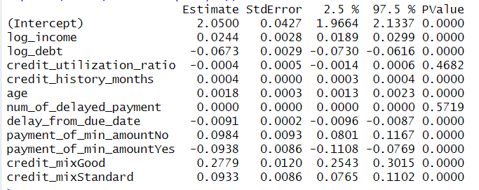
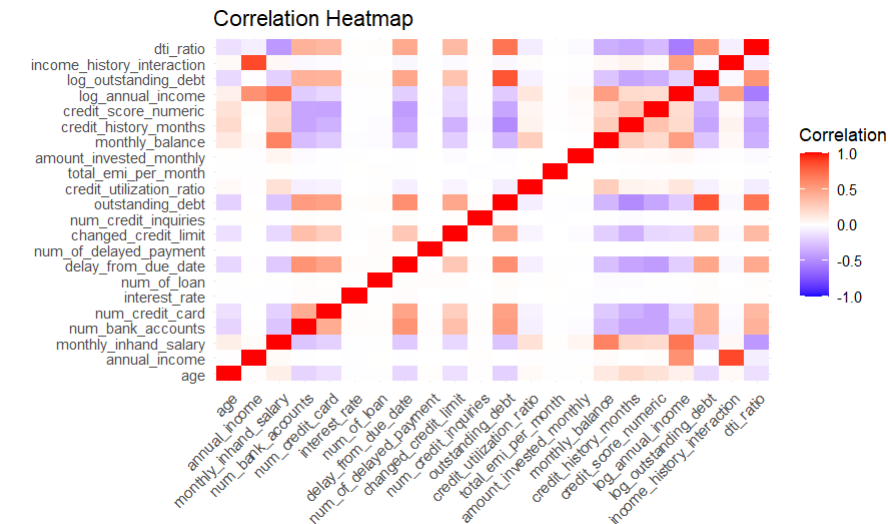
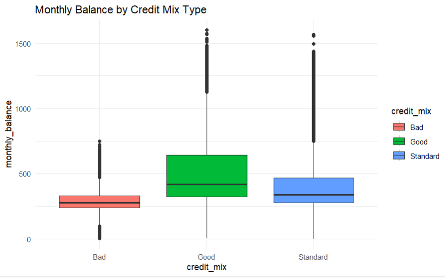
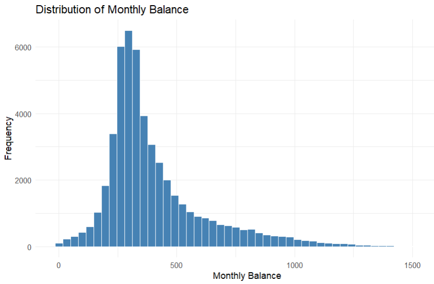
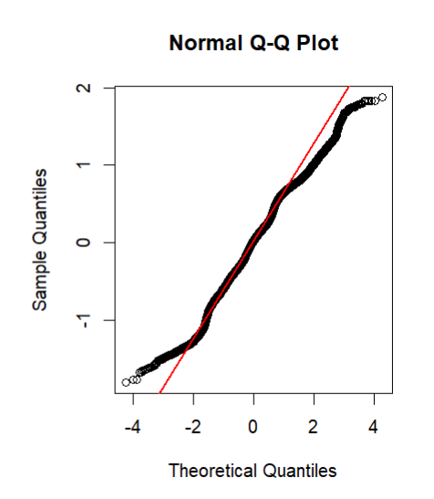

# Credit score prediction (R)

## Project overview
This project focuses on predicting credit scores and analyzing financial behavior using statistical modeling in **R**. It demonstrates a complete data science pipeline: from aggressive data cleaning and feature engineering to complex regression diagnostics and cross-validation.

### 1. Data cleaning & preparation
Real-world financial data is often "messy." In this project, I implemented:
* **Custom Cleaning Functions:** Stripped non-numeric characters and standardized financial fields using `stringr` and `dplyr`.
* **Outlier Handling:** Applied business logic to cap variables like Age and Number of Bank Accounts to realistic ranges.
* **Feature Engineering:** Converted "Credit History Age" into a numeric month-based metric and created interaction terms like the Debt-to-Income (DTI) ratio.

### 2. Exploratory data analysis
Comprehensive visualization was used to understand data distributions and relationships.

* **Correlation analysis:** Identified key predictors using a correlation heatmap.
* **Financial distributions:** Analyzed the skewness of monthly balances and annual income.

### 3. Statistical modeling
I developed and compared three Linear Regression models:
1. **Baseline Model:** Using primary financial indicators.
2. **Extended Model:** Adding behavioral data (delayed payments, payment history).
3. **Transformed Model (Final):** Utilizing log-transformations to handle skewed distributions and improve model fit.

### Model statistics & key findings
I performed a multiple linear regression to identify the most significant drivers of credit scores. 

**Key observations from the regression analysis:**
* **Income & Debt (Log Transformed):** Both variables showed high statistical significance ($p < 0.001$), confirming that normalized financial metrics are strong predictors.
* **Credit Mix:** Customers with a "Good" credit mix showed a significant positive estimate ($0.2779$), indicating a strong correlation with higher credit scores.
* **Payment Behavior:** The model successfully captured that not paying the minimum amount significantly impacts the score (Estimate: $-0.0938$).
* **Model Reliability:** Most variables achieved a $p$-value of $0.0000$, validating the strength of the selected features.

## Visualizations
*(Below are the insights generated from the R script)*

### Correlation heatmap
This heatmap reveals the strength of relationships between various financial metrics and the target credit score.

### Distribution of monthly balance
Analyzing how balances are spread across the dataset.

### Model diagnostics (Q-Q Plot)
Used to verify the normality of residuals, ensuring the statistical validity of the regression model.

## Tech Stack
* **Language:** R
* **Libraries:** `tidyverse` (dplyr, ggplot2, tidyr), `caret`, `janitor`, `corrplot`.
* **Methodologies:** Linear Regression, Log Transformation, K-fold Cross-Validation, Residual Analysis.
